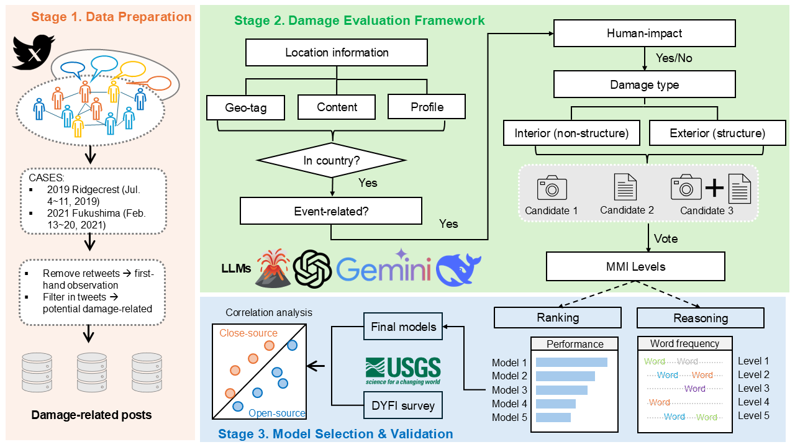

# 🌀 3M Pipeline for Disaster Damage Assessment

This repository implements the **3M (Multimodal, Multilingual, and Multidimensional)** pipeline for fine-grained disaster damage assessment using social media and multimodal large language models (MLLMs).

## 🔍 Overview

The 3M pipeline operates in three stages:

1. **Data Preparation**: Filtering and geolocating disaster-related tweets.  
2. **Damage Evaluation**: Using MLLMs to classify damage severity (MMI scale) from text and image inputs.  
3. **Model Evaluation**: Correlating model predictions with DYFI ground-truth data and analyzing input modality, prompt sensitivity, and reasoning transparency.

## 🌍 Case Studies

- **2019 Ridgecrest Earthquake** (USA)  
- **2021 Fukushima Earthquake** (Japan)

## 🤖 Supported Models

- `LLaVA 3–8B`  
- `Qwen 2.5-VL-7B`  
- `Gemini-2.5-Flash`

## 📁 Directory Structure
'''
├── data_opreparation/ # Preprocessed tweet data
├── damage_evaluation/ # Prompt templates used for LLMs and model call scripts and configs
├── model_validation/ # Correlation and reasoning analysis
├── results/ # CSV files with sample damage evaluation results.
└── README.md # Project documentation
  

📝 *Note: All original user information has been removed from these files. The full dataset is available upon request.*

## 📊 Results

Key findings from the 3M pipeline experiments:

- **~Near-moderate correlation** with DYFI ground-truth seismic data  
- **Robust performance** in urban and multilingual contexts  
- **Effective reasoning** patterns and model interpretability analysis  
- **Limitations** in high-intensity damage detection and low-signal/multilingual regions  

